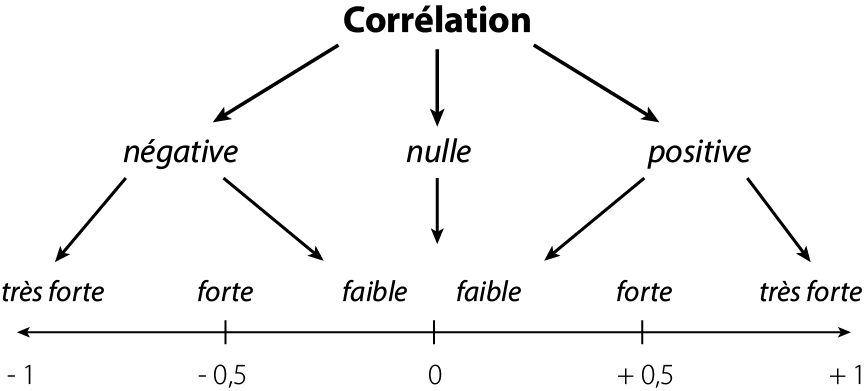

```{r setup, include=FALSE}
library(learnr)

tutorial_options(
  exercise.timelimit = 60,
  # A simple checker function that just returns the message in the check chunk
  exercise.checker = function(check_code, ...) {
    list(
      message = eval(parse(text = check_code)),
      correct = logical(0),
      type = "info",
      location = "append"
    )
  }
)

## Global options
knitr::opts_chunk$set(echo=TRUE,
                      eval=TRUE,
                      error = TRUE,
        	            cache=FALSE,
                      prompt=FALSE,
                      comment=NA,
                      message=FALSE,
                      warning=FALSE,
                      class.source="bg-info",
                      class.output="bg-warning")

```

## Introduction

<p>

**Cet atelier est animé par Grégoire Le Campion et Laurence Reboul.**

Il s'agit dans cet atelier de suivre tout le chemininement sur R pour réaliser une analyse de corrélation, un modèle de régression linéaire et le diagnostic de ce modèle.
<br>
En revanche,il ne s'agira pas ici de revenir sur le fond theorique de ce que sont une analyse de correlation et un modèle de régression. L'objectif de cet atelier est de permettre à tous les participant de cette ANF de partir sur les mêmes bases pour la réalisation sur R de ces analyses.
<br>
Il ne s'agit donc pas d'un atelier de perfectionnement sur la correlation ou la régression et ce n'est pas un atelier d'initiation à R.
<br>
Nous vous présenterons un "workflow" personnel qui pourra être l'objet d'échange avec les participant aguerris, ou un guide pour les novices.


<br>
Pour télécharger les données que nous utiliserons ici (et qui pourront servir tout au long de la semaine) :

Les données présentées en exemple au cours de cet atelier :
<br>   
<p class="center">[<span style="font-size: 230%;" class="glyphicon glyphicon-download-alt"></span> <br/> Télécharger les données prix de l'immobilier](https://gitlab.in2p3.fr/letg/initiation-formation-aux-statistiques-spatiales/-/blob/master/public/data/donnees_standr.csv)</p>
<br>

Un jeux de données pour ceux qui voudraient expérimenté par eux même :
<br>   
<p class="center">[<span style="font-size: 230%;" class="glyphicon glyphicon-download-alt"></span> <br/> Télécharger les données Marseille](https://gitlab.in2p3.fr/letg/initiation-formation-aux-statistiques-spatiales/-/blob/master/public/data/data_marseille.csv)</p>
<br>

Petit rappel du programme :

<p>

## Présentation et chargement des données

### Nos packages

Voici la liste des packages que nous allons utiliser pour cet atelier :

```{r, echo=TRUE}

## Pour le chargement des données, leur visualisation et manipulation
library(here)
library(dplyr)
library(DT)
library(table1)

## Pour la réalisation des tests et analyse statistiques
library(correlation)
library(parameters)
library(performance)
# Ces trois packages peuvent être appellés en une fois avec library(easystats). Easystats est une suite de packages tournée vers la réalisation de statistique et offre un environnement de travail trè sdocumenté et intéressant.
library(car)


## Représentations graphiques
library(plotly)
library(RColorBrewer)
library(ggplot2)
library(ggraph)
library(corrplot)
library(GGally)
library(gtsummary)

## Représentation cartographique
library(mapsf)


```

## Nos données

### Présentation des données 

#### Le prix de l'immobillier

Ce fichier a été constitué par Frédéric Audard et Alice Ferrari à partir de la base Notaires de France (https://www.immobilier.notaires.fr/fr/prix-immobilier). C'est ce fichier que nous utiliserons comme exemple. Il contient les variables suivantes :

- SIREN : code SIREN de l'EPCI
- prix_med : pris médian par EPCI à la vente (au m2 ?)
- perc_log_vac : % logements vacants
- perc_maison : % maisons
- perc_tiny_log : % petits logements (surface < ?)
- dens_pop : densité de population (nb habitants / km2 ?)
- med_niveau_vis : médiane du niveau de vie
- part_log_suroccup : % logements suroccupés
- part_agri_nb_emploi : % agriculteurs
- part_cadre_profintellec_nbemploi : % cadres et professions intellectuelles

La varibale SIREN, correspond à un identifiant et la variable prix_med sera notre variable dépendante.
Attention, hormis les deux variables que nous venons de citer toutes les autres ont été standardisé.

> "Un EPCI est un établissement public de coopération intercommunale (EPCI) C'est une structure administrative permettant à plusieurs communes d’exercer des compétences en commun.
Les EPCI sont soumis à des règles communes, homogènes et comparables à celles de collectivités locales. Les communautés urbaines, communautés d'agglomération, communautés de communes, syndicats d'agglomération nouvelle, syndicats de communes et les syndicats mixtes sont des EPCI." Définition INSEE

<div class="alert alert-danger" role="alert">
Aparté sur la standardisation : on parle daussi de données centrées-réduites, cla implique qu'elles ont subi une transformation statistique visant à ce qu'elles aient une moyenne de 0 et un écart-type de 1.
Cette transformation permet de conserver la variabilité de nos données et de rendre nos prédicteurs comparables.
<hr>
Lorsque l'on s'apprête à faire de la modélisation statistique il est très recommandé de réaliser cette opération au moins sur les variables que vous utiliserez comme variables explicatives dans votre modèle.
<hr>
Sur R on peut facilement réaliser cette opération avec la fonction [scale()](https://r-lang.com/scale-function-in-r/). Cette opération peut également être réalisée manuellement, en soustrayant chaque valeur par la moyenne puis en divisant par l'écart-type.</div>


##### Marseille

Il s'agit d'un fichier qui pourra servir pour mettre en pratique les lignes de codes que nous allons voir ici.
Il s'agit des données de pauvreté par IRIS de la ville Marseille. Ces données proviennent de l'INSEE (https://www.insee.fr/fr/statistiques/6049648)

> "L'IRIS Un sigle qui signifie « Ilots Regroupés pour l'Information Statistique » et qui fait référence à la taille visée de 2 000 habitants par maille élémentaire." Définition INSEE

Il contient les variables suivantes : 

- id_IRIS : code IRIS
- label_iris : nom de l'IRIS
- code_insee : code INSEE de la commune
- label_com : nom de la commune
- tx_bas_revenu : taux de bas revenus déclarés au seuil de 60% (%) (variable DEC_TP6019 du fichier [BASE_TD_FILO_DEC_IRIS_2019.csv](https://www.insee.fr/fr/statistiques/6049648))
- PartPop_fr : 
- hlm_res_princ : part /personne de résidences principales HLM loué vide en 2017 (%) (variable P17_RP_LOCHLMV du fichier [base-ic-logement-2017](https://www.insee.fr/fr/statistiques/4799305))
- unevoiture : part de ménages disposant au moins d'une voiture en 2017 (%) (variable P17_RP_VOIT1P du fichier [base-ic-logement-2017](https://www.insee.fr/fr/statistiques/4799305))
- res120plus : part de résidences principales de 120 m2 ou plus en 2017 (%) (variable P17_RP_120M2P du fichier [base-ic-logement-2017](https://www.insee.fr/fr/statistiques/4799305))
- masc_cadre : part d'hommes de 15 ans ou plus cadres et professions intellectuelles supérieures (%) (variable C17_H15P_CS3 du fichier [base-ic-evol-struct-pop-2017](https://www.insee.fr/fr/statistiques/4799309?sommaire=4658626))
- fem_noncadre : part de femmes de 15 ans ou plus autres sans activité professionnelle (variable C17_F15P_CS8 du fichier [base-ic-evol-struct-pop-2017](https://www.insee.fr/fr/statistiques/4799309?sommaire=4658626))

Attention, comme précédemment les variables qui peuvent constituer les prédicteurs ont été centrées-réduites (la variable tx_bas_revenu n'a pas été standardisée).

### Chargement des données sur le prix de l'immobilier par EPCI

```{r chargement, exercise = FALSE, exercise.eval = FALSE}
csv_path <- here("data", "donnees_standr.csv")
immo_df <- read.csv2(csv_path)

#Pour visualiser les données dans le doc
datatable(head(immo_df, 10))
```


### Chargement des données géographiques : les EPCI de France métropolitaine

Ces données proviennent de la base [ADMIN-EPXRESS-COG de l'IGN](https://geoservices.ign.fr/adminexpress){target="_blank"}, édition 2021. On les charge dans un format sf, ce qui nous permet d'utiliser le package mapsf [@mapsf] pour les prévisualiser :

```{r}
library(sf)
library(mapsf)
shp_path <- here("data", "EPCI.shp")
epci_sf <- st_read(shp_path)
# pour voir les données géographiques
mf_map(x = epci_sf)
# et la table attributaire correspondante, avec le package DT
datatable(head(epci_sf, 10))
```


### Jointure des données géographiques et tabulaires

Les 2 données n'ont pas le même nombre de lignes :
```{r}
nrow(immo_df)
nrow(epci_sf)
```

Pour voir les EPCI qui n'ont pas de correspondance dans le tableau de données :
```{r}
# l'option all.x = TRUE permet de garder toutes les lignes de epci_sf,
# même celles qui n'ont pas de correspondance dans immo_df
data_immo <- merge(x = epci_sf, y = immo_df, by.x = "CODE_SIREN", by.y = "SIREN", all.x = TRUE)
nrow(data_immo)
# on peut filtrer les données de la jointure pour ne voir que les epci n'ayant pas de correspondance dans le tableau immo_df
datatable(data_immo[is.na(data_immo$prix_med),])
mf_map(x = data_immo)
mf_map(x = data_immo[is.na(data_immo$prix_med),], col = 'red', add = TRUE)
```

<div class="alert alert-warning" role="alert">
  Les EPCI manquants de la petite couronne parisienne sont en réalité également compris dna l'EPCI Métropole du Grand Paris. On peut donc avoir un découpage plus précis des EPCI de la petite couronne (en rouge sur la carte précédente) ou les intégrer à un EPCI plus large qui tient compte de Paris intra-muros et de la la petite couronne. C'est ce dernier que nous utiliserons pour les analyses.
  
</div>

On refait la jointure en ne gardant que les EPCI ayant une correspondance dans le tableau de données (on choisit donc de laisser de côté les EPCI non listés dans le fichier CSV)

```{r}
data_immo <- merge(x = epci_sf, y = immo_df, by.x = "CODE_SIREN", by.y = "SIREN")
nrow(data_immo)
datatable(head(data_immo, 10))
```
 
 
```{r, echo=FALSE}
library(spdep)
# Création de la liste des voisins : avec l'option queen = TRUE, 
# sont considérés comme voisins 2 polygones possédant au moins 1 sommet commun
#help(poly2nb)
neighbours_epci <- poly2nb(data_immo, queen = TRUE) 

neighbours_epci_w <- nb2listw(neighbours_epci)
```

## Etape 1 : Exploration des variables

Cette première étape d'exploration est fondamentale. Elle permet une première approche des données et d'entamer une réflexion sur nos données, leur distribution, la présence d'éventuels individus extrêmes...

Cela peut se faire statistiquement avec des indicateurs de statistiques descriptives :


```{r}
library(table1)

table1(~ prix_med + perc_log_vac + perc_maison + perc_tiny_log + dens_pop + med_niveau_vis + part_log_suroccup + part_agri_nb_emploi + part_cadre_profintellec_nbemploi, data=immo_df) 

```

<br> 
Ou graphiquement :
<br> 

```{r}
# Distribution de la variable dépendante :
library(plotly)
add_histogram(plot_ly(data_immo, x = ~prix_med))
```

```{r}
# Distribution des variables indépendantes :
a <- add_histogram(plot_ly(data_immo, x = ~log(perc_log_vac), name = "perc_log_vac"))
b <- add_histogram(plot_ly(data_immo, x = ~log(perc_maison), name = "perc_maison"))
c <- add_histogram(plot_ly(data_immo, x = ~log(perc_tiny_log), name = "perc_tiny_log"))
d <- add_histogram(plot_ly(data_immo, x = ~log(dens_pop), name = "dens_pop"))
e <- add_histogram(plot_ly(data_immo, x = ~log(med_niveau_vis), name = "med_niveau_vis"))
f <- add_histogram(plot_ly(data_immo, x = ~log(part_log_suroccup), name = "part_log_suroccup"))
g <- add_histogram(plot_ly(data_immo, x = ~log(part_agri_nb_emploi), name = "part_agri_nb_emploi"))
h <- add_histogram(plot_ly(data_immo, x = ~log(part_cadre_profintellec_nbemploi), name = "part_cadre_profintellec_nbemploi"))
fig = subplot(a, b, c, d, e, f, g, h, nrows = 2)
fig
```

Dans notre cas ici sur le prix median on peut se poser la question de conserver dans notre jeu de données l'entité spatiale avec un prix médian à plus de 10000, qui est visiblement un outlier.

## Etape 2 : étude des corrélations

### Micro rappel théorique

**La corrélation permet d'étudier le lien, la relation entre deux variables.**

La corrélation repose sur la covariance entre les variables.
Quand 2 variables covarient, un écart à la moyenne d'une variable est accompagné par un écart dans le même sens (corrélation positive) ou dans le sens opposé (corrélation négative) pour le même individu de l'autre variable. Dit autrement, lorsque deux variables covarient, pour chaque valeur qui s'écarte de la moyenne, on s'attend à trouver un écart à la moyenne pour l'autre variable.

Une corrélation est nécessairement comprise entre 1 et -1.

**Un coefficient de 1 indique une corrélation positive parfaite entre les deux variables.** Quand la variable $x$ augmente la variable $y$ augmente dans la même proportion. **À l'inverse, un coefficient de – 1 indique une corrélation négative parfaite **: lorsque la variable $x$ augmente, la variable $y$ diminue dans la même proportion. Dans les deux cas, les points tombent parfaitement sur la droite. Un coefficient de 0 indique qu'il n'y a aucune relation entre les deux variables. Ainsi, la variation de l'une n'est aucunement associée à la variation de l'autre.

*Par exemple, ici le % de petits logements est corrélé positivement au taux de logements suroccupés : si l'une de ces 2 variables augmente, l'autre aussi. A l'inverse, le % de maisons est corrélé négativement au taux de logement suroccupés : si l'une de ces 2 variables augmente, l'autre diminue.*

Pour évaluer l'importance d'une corrélation on utilise souvent la convention suivante :

```{r fig1, echo=FALSE, fig.cap="Interprétation d'une corrélation", out.width = '80%', fig.align = 'center'}

```


L'analyse de corrélation présente plusieurs intérêts. Le premier étant bien sur d'étudier les relations entre les variables, ce qui en soit peut s'avérer très intéressant.
Ensuite, la conception d'un modèle doit absolument être le fruit d'une réflexion portant sur le choix des variables indépendantes (explicatives) et le choix de la méthode de régression. Et pour définir un modèle de régression certaine règles doivent (dans un monde parfait) être respectées. L'étude des corrélations peut donc apporter une aide précieuse dans cette réflexion. Elle pourra nous aider dans le choix des variables à intégrer au modèle, et dans le même temps à vérifier certaines des conditions de réalisation de notre régression.

Ainsi, une analyse des corrélations pourra vérifier :

- l'existence d'un lien entre les variables indépendantes (VI) et la variable à étudier (VD). En effet dans une régression linéaire, il est nécessaire d'avoir une relation linéaire entre la VD et les différentes VI.
- la multicolinéarité des variables indépendantes. Les corrélations ne doivent pas être trop fortes entre nos VI. Un coefficient > 0.7 en valeurs absolues doit entraîner la suppression des variables concernés. Cela peut aussi être vérifié très efficacement avec le VIF (Variance Inflation Factor) mais peut se faire seulement après avoir lancé notre modèle.
- L'absence de corrélation entre les variables explicatives du modèle et les variables externes. En effet, les variables d'influence doivent être incluses dans le modèle (sauf dans le cas où cela induirait une trop grande multicolinéarité).

Pour calculer nos corrélation nous utiliserons le package bien nommé `correlation`. Ce package présente de nombreux avantages, comme plusieurs manière de présenter nos résultats (base de données, matrice...). Il intégre par défault des tests de corrections qui permettent des calculs plus robustes, il est compatible avec la méthode bayesienne, propose un grand nombre de méthode différentes...

<div class="alert alert-warning" role="alert">
Attention ici nos données exemple sont "parfaites", nous avons des données quantitatives qui marchent très bien pour cet atelier. Avec d'autre données il faudra veiller à se renseigner sur les différents arguments de la fonction `correlation`. Pour en savoir plus vous pouvez éventuellement vous référer au site [Rzine](https://rzine.fr/){target="_blank"} et notamment la fiche [Analyse des corrélations avec easystats, Guide pratique avec R.](https://rzine.fr/docs/20200526_glecampion_initiation_aux_correlations/index.html) [@easystats]
</div>

### Réalisation des correlations avec R

L'analyse se lance simplement avec ces lignes de codes:

```{r}
library(correlation)

data_cor <- immo_df %>% select(-SIREN)
immo_cor <- correlation(data_cor)

```

Un des avantages de l'analyse de corrélations c'est que les résultats sont facilement interprétables et accessible de beaucoup de manière différentes

```{r}

# En mode base de données
datatable(head(immo_cor, 10))

# En matrice des corrélations
summary(immo_cor)
```

On peut aussi visualiser les corrélations de nombreuses manières différentes, il y a le classique scatter plot pour visualier la relation entre deux variables mais pour représenter notre matrice la figure classique est le corrélogramme :

1. Méthode simple avec le package `see`
```{r}
library(see)
immo_cor %>%
  summary(redundant = FALSE) %>%
  plot(type="tile", show_labels =TRUE, show_p = TRUE, digits = 1, size_text=3) +
  see::theme_modern(axis.text.angle = 45)

```

2. Méthode plus complexe avec le package `corrplot` mais permet d'avantage de personnalisation
```{r, out.width="960px",out.height="700px", fig.align = 'center'}

#création d'une matrice redondante
mat_cor_comp <- summary(immo_cor, redundant = TRUE)
# Nom des lignes = valeurs de la première colonne ("Parameter")
rownames(mat_cor_comp ) <- mat_cor_comp[,1]
# Transformation du data.frame en objet matrice (+ suppression première colonne)
mat_cor<- as.matrix(mat_cor_comp[,-1])
# Calcul du nombre total d'individus
nb <- nrow(data_cor)
# Calcul des matrices de p-values et des intervalles de confiance
p.value <- cor_to_p(mat_cor, n = nb, method = "auto")
# Extraction de la matrice des p-value uniquement
p_mat <- p.value$p

library(corrplot)
library(RColorBrewer)

corrplot(mat_cor, 
         p.mat = p_mat, 
         type = "upper", 
         order = "hclust", 
         addCoef.col = "white", 
         tl.col = "gray",
         number.cex = 0.5,
         tl.cex= 1,
         tl.srt = 45, 
         col=brewer.pal(n = 8, name = "PRGn"), 
         sig.level = 0.000001, 
         insig = "blank", 
         diag = FALSE, )
```

La représentation sous forme de réseau peut être très intéressante notamment quand il y a un grand nombre de variables, et donc de corrélations.

```{r warning=FALSE}

library(ggraph) # needs to be loaded

immo_cor$val <-if_else(
  immo_cor$r>0, "positif", "négatif"
)

ggraph(immo_cor, layout = "stress") +
 geom_node_point(size = 8, color="grey")+
  geom_node_text(aes(label = name),family = "serif",repel = TRUE,  max.overlaps = getOption("ggrepel.max.overlaps", default = Inf))+
  geom_edge_link2(aes(filter = p<0.05, edge_colour= val, edge_width = abs(r), label = round(r, 2))) + # on peut indiquer sur le lien avec l'argument  label = r
  scale_edge_width_continuous(range = c(0.1,3))+
scale_edge_color_manual(
    values = c("positif" = "#1B9E77",
               "négatif" = "#D95F02")
  )

```


Pour vérifier la relation entre notre VD et une VI on peut classiquement faire un scatter plot, ici par exemple entre le prix médian (VD) et le pourcentage de logements vacants (VI).

```{r warning=FALSE}
# Relations bivariées - formes fonctionnelles
ggplot(data_immo, aes(x=log(perc_log_vac), y=log(prix_med))) + 
  geom_point() + geom_smooth()
```

Le nuage de point est l'autre représentation standard des corrélation. Il s'agit ici d'analyse la forme du nuage pour avoir une information sur la corrélation. Cette relation n'est pas la simple à lire mais ce qu'il faut retenir c'est plus vos points sont regroupé autour de la droute de régession plus il y a de la chance que la corrélation soit significative. La forme du nuage nous donnera le signe de la corrélation. Un nuage qui part d'en bas à gauche vers en haut à droite aura une corrélation positive et un nuage qui va d'en haut à gauche vers en bas à droite aura une corrélation négative.

Mais ce qui serait plus intéressant serait une représentation de notre VDvis à vis de toutes nos VI. On peut utiliser alors un diagramme en barres.

```{r warning=FALSE}
library(corrr)

# Matrice de corrélation -> data.frame de corrélation
hist_cor <- as_cordf(mat_cor)

# Sélection des corrélations de la variable "year"
hist_cor <- focus(hist_cor, prix_med)
# Si la valeur est positive  = TRUE, sinon FALSE
hist_cor$correlation <- hist_cor$prix_med > 0

ggplot(hist_cor, aes(x = reorder(term, prix_med), y = prix_med, fill = correlation)) +
      geom_bar(stat = "identity", colour = "black") +
      ylab("Corrélation") +
      xlab("Variables") +
      scale_fill_discrete(labels = c("Négative", "Positive")) +
      theme_modern(axis.text.angle = 45) 

```

## Etape 3 : Régression linéaire ou Méthode des moindre carrés ordinaire (MCO)

### Micro rappel sur la régression

La régression linéaire est un des modèles les plus utilisés en SHS, elle peut être simple (une seule variable explicative) ou multiple (plusieurs VI). Le principe n'est en réalité pas si complexe. La régression linéaire consiste à modéliser la covariation entre une variable à expliquer et une ou des variables explicatives.

Pour ce faire, le modèle de régression va chercher à estimer les termes de l'équation de la droite de régression entre la variable à expliquer et la variable explicative. Cette équation va prendre la forme $f(x)= ax + b + e_i$. Équation qui ressemble à la fonction affine qui a dû hanter vos nuits de collégien.

Si on reprend l'exemple précédent où l'on cherche à modéliser la covariation entre le prix médian et le pourcentage de logement vacant, l'équation de notre droite de régression ressemblerait à  : $prixmed_i = a*perclogvac_i + b + e_i$.

Où $a$ est le coefficient associé à la variable du pourcentage de logements vacants, $b$ est la constante qui apparaîtra sous le nom d'intercept dans les résultats et enfin $e$ qui lui correspond aux résidus. Les résidus étant ce qui incarne l'écart au modèle.

<br> 

Traditionnellement on va faire usage d'une régression linéaire lorsque l'on veut prédire les valeurs de notre VD dans les cas où elle n'aurait pas été mesurée, ou bien si l'on souhaite comprendre les relations statistiques entre les variables. Comment le sprédicteurs vont expliquer notre variable dépendante.


Pour lancer notre modèle de régression linéaire, on va utiliser la fonction [lm()](https://www.rdocumentation.org/packages/stats/versions/3.6.2/topics/lm) dont les 2 lettres sont l'acronyme de *linear model* :

<div class="alert alert-warning" role="alert">
Il existe un très grand nombre de modèle de régression, le choix dépendra de vos données et de ce que vous voulez faire.
</div>

Sur R la réalisation d'un modèle de régression linéaire se fait très simplement :
```{r}
# Dans le fonctionnement sur R il est important de stocker la régression dans un objet.
mod.lm <- lm(formula = prix_med ~ perc_log_vac + perc_maison + perc_tiny_log + dens_pop + med_niveau_vis + part_log_suroccup + part_agri_nb_emploi + part_cadre_profintellec_nbemploi, 
             data = data_immo)

# On affiche les principaux résultats avec la fonction summary
summary(mod.lm)
```

Une des fonction les plus utile dans tout l'écosystème R est la fonction `summary()`, ici pour notre régression elle va nous fournir tous les élément utile à l'interprétation. Voci donc ce qu'elle nous sort :

- Call : la fomule du modèle ;
- Residuals : des statistiques descriptives des résidus ;
- Coefficients : un tableau à deux entrées où les lignes correspondent aux coefficients associés aux variables explicatives, et les colonnes, dans l’ordre, à l’estimation du coefficient, l’écart-type estimé, la valeur du test de Student de nullité statistique du coefficient et enfin la p-value associé à ce test, suivie d’un symbole pour lire rapidement la significativité;
- Signif. codes : les significations des symboles de niveau de significativité ;
- Residual standard error : estimation de l’écart-type de l’aléa et degré de liberté ;
- Multiple R-squared : coefficient de détermination ;
- Adjusted R-squared : coefficient de détermination ajusté ;
- F-statistic : valeur de la statistique de Fisher du test de significativité globale, ainsi que les degrés de liberté et la p-value associée au test.

Pour visualiser les résultats des tests statistiques il existent un grand nombre de package et de fonctions. On peut citer par exemple la fonction `tbl_regression` du package gtsummary  ou la fonction `model_parameters` du package `parameters`.
```{r}
library(gtsummary)
mod.lm %>%
  tbl_regression(intercept = TRUE)

library(parameters)
model_parameters(mod.lm) |> print_md()
```

On peut visualiser graphiquement les coefficients des variables explicatives, ce qui peut s'avérer très utile :
```{r}
GGally::ggcoef_model(mod.lm)

```

Faire une régression linéaire sur R c'est finalement très simple ! Mais le vrai enjeux c'est l'interprétation des résultats !

### Interpréter les résultats


Pour interpréter les résultats plusieurs éléments fournis par la commande `summary(mod.lm)` sont importants.

```{r, echo=FALSE, fig.cap="Résultats de la commande *summary(mod.lm)*", out.width = '500', fig.align = 'center'}
knitr::include_graphics(here("images", "resreg.png"))
```

Commençons par les informations qui concernent notre modèle dans sa globalité. D'abord l'information fournie par `Adjusted R-squared`, il s'agit du $R^2$ qui est le coefficient de détermination. Il est ici de 0.77 ce qui peut se traduire par **77% de la variation du prix médian est expliqué par notre modèle**. Juste en-dessous, on a le **p-value** associé à notre modèle. S'il est inférieur à $0.05$ on peut considérer que le modèle est statistiquement significatif.

Ensuite, regardons ce qu'il se passe au niveau des variables explicatives :

- La première colonne appelée `estimate` est le coefficient de régression associé à la variable explicative. Le signe va être très important car il va donner la direction de la relation (exactement comme pour les corrélations). Ici pour le pourcentage de logements vacants il est de $-287$ ce qui veut dire que lorsque ce pourcentage augmente de $1\%$ alors le prix médian baisse de $287€$

- La colonne $Pr(>|t|)$ correspond à la p-value associé à ce résultat. Une fois encore si elle est inférieure à $0.05$ alors on peut le considérer comme statistiquement significatif. Dans notre cas on peut dire que la part d'agriculteurs, de cadres et professions intellectuelles dans le nombre d'emploi n'ont pas un effet significatif sur le prix médian du logement.

<div class="alert alert-success" role="alert">
La $t-value$ est le coefficient divisé par son erreur standard. Plus ce quotient est proche de $0$ plus on peut considérer qu'il n'y a pas d'effet de notre VI sur notre VD. En revanche dans le cas où on aurait plus de 200 individus si $|t-value| > 1.96 $ alors on peut considérer qu'il y a $95\%$ de chance qu'il y ait un effet significatif de la VI sur la VD.
</div>

<div class="alert alert-danger" role="alert">
Nous sommes ici dans le cas d'une régression linéaire multiple avec donc plusieurs prédicteurs.
Or dans la régression linéaire les effets des variables explicatives sont considérés comme "purs", la lecture des effets de chaque VI doit se faire selon un principe de "toutes choses égales par ailleurs".
<hr>
Ainsi, le pourcentage de logements vacant a un effet sur le prix médian toutes choses égales quant aux autres variables explicatives.
<hr>
On peut bien sur aller au delà de ce raisonnement, à l'aide de méthode plus complexe.
Mais c'est aussi possible dans le cadre d'un modèle linéaire au sein duquel on peut étudier l'intéraction entre des prédicteurs. Rajouter une intéraction se fait très simplement en metant une * entre deux variable.
Par exemple, dans notre cas si nous souhaitons étudier en plus l'interaction entre la densité et le niveau de vie médian nous rajoutons à notre modèle `dens_pop*med_niveau_vis`.
<hr>
On peut aussi envisager les méthodes de médiation et de modération. Il existent de très nombreux tutoriel sur ce sujet, et cela fonctionne très bien avec R.
</div>

Finalement tout va pour le mieux dans le meilleur des mondes ! On a donc pu réaliser notre régression et interpréter les résultats. Mais en réalité, nous avons pas abordé le point le plus sensible lorsque l'on réalise un modèle de régression linéaire.
Notre modèle est-il viable ? Les conditions nécessaire d'application sont-elle respecté ? Et c'est bien là le plus dure dans la régression.

## Diagnostic du modèle

Les prémisses ou condition à vérifier dans le cadre de la réalisation d'un modèle linéaire multiple sont très nombreuses , en voici la liste : 

1. Les types de variables à utiliser : continue ou catégorielle (ordinale ou dichotomique) pour nos prédicteurs, continue pour notre variable à prédire.

2. Pas de variance égale à zéro : la distribution des prédicteurs doit comprendre une certaine variance, donc ne doit pas être constante.

3. Aucune multicolinéarité parfaite : il ne doit pas y avoir de relation linéaire parfaite entre deux ou plusieurs variables indépendantes. Par conséquent, les corrélations ne doivent pas être trop fortes entre celles-ci. Cette prémisse peut être vérifiée avec le VIF (Variance Inflation Factor) indiquant si une variable indépendante a une une relation linéaire forte avec les autres.

4. Pas de corrélation entre les variables indépendantes et les variables externes : les variables d’influence doivent toutes être incluses dans le modèle.

5. Homéocédasticité (homogénéité des variances des résiduels) : la variance des valeurs résiduelles doit être similaire à tous les niveaux de la variable indépendante.

6. Indépendance des erreurs : les valeurs résiduelles ne doivent pas être corrélées entre les individus. Cette prémisse peut être vérifiée avec la statistique Durbin-Watson qui se situe entre 0 et 4, une valeur de 2 indiquant une absence de corrélation, moins de 2 une corrélation positive et plus de 2, une corrélation négative. La règle arbitraire cette fois est que la valeur ne doit pas être plus petite que 1 ou plus grande que 3.

7. Distribution normale des résidus : bien que les variables indépendantes ne doivent pas nécessairement suivre une distribution normale, il importe que les résiduels en suivent une. Ils doivent donc avoir une moyenne de 0, la majorité des valeurs doivent s’en rapprocher. Cette prémisse peut être vérifiée en enregistrant les valeurs résiduelles dans la base de données et en effectuant le test de Kolmogorov-Smirnov ou de Shapiro-Wilks. Vous devez vous assurer que le test n’est pas significatif pour conserver l’hypothèse nulle de distribution normale.

8. Indépendance de la variable prédite : toutes les observations formant la distribution des valeurs de la variable dépendante sont indépendantes, viennent d’un individu différent.

9. Relation linéaire entre les variables indépendantes et la variable dépendante : la variation de la variable dépendante pour chaque augmentation d’une unité d’une variable indépendante suit une ligne droite.


En SHS, il est rare de voir toutes les conitions entiérement respectées, on va même trouvé des différence disciplinaire (par exemple sur le seuil acceptable de la multicolinéarité) ceci dit certaines conditions sont plus importantes que d'autre car non respectées elles peuvent vraiment venir perturber significativement votre modèle votre modèle. Il est de toute manière toujours bon d'avoir ces informations sur vos données.

### La Multicolinéarité

Un des enjeux les plus important dans le cadre de régression multiple est de vérifier la multicolinéarité entre les variables explicatives. Le risque d'une trop grande colinéarité est de biaiser le modèle et notamment de biaiser les estimations des erreurs type des coefficient de régression (et donc les t-value et p-value).

L'analyse préalable des corrélations donne déjà de forte présemption sur un risuqe de multicolinéarité mais attention il ne faut pas confondre la multicolinéarité avec une "forte corrélation brutes" entre les prédicteurs. La multicolinéarité entre deux prédicteurs peut survenir lorsqu'une troisième variable non observée a un effet causal sur chacun des deux prédicteurs associés au résultat. Dans de tels cas, la relation réelle qui compte serait l’association entre la variable non observée et le résultat.

La **VIF (Variance Inflation Factor)** est une très bonne méthode pour vérifier et peut être confirmer les risques de multicolinéarité. Elle suppose simplement d'avoir estimé un premier modèle pour être utilisée.
Cela se fait très simplement sur R, je vus montre plusieurs manière de le faire à vous de choisir celle que vous préférez.

```{r}
# Avec la librairie "car"
library(car)

vif(mod.lm)

# Avec la librairie "performance" de la suite easystats qui propose beaucoup de choses globalement pour vous faciliter la vie si vous faites de la modélisation statistique. Toutefois attention ce sont plutôt des psychologues qui en sont à l'origine et ce sont donc plutôt leurs normes disciplinaires.

library(performance)

check_collinearity(mod.lm)

# On peut aussi directement l'ajouter au résumé des coefficient obtenu avec gtsummary

library(gtsummary)

mod.lm %>%
  tbl_regression(intercept = TRUE) %>% add_vif()


```


<div class="alert alert-danger" role="alert">
Je n'ai pas trouvé dans la littérature de "loi" indiquant le seuil absolu de VIF à ne pas dépasser. Les sources en SHS varient en fonction des disciplines : certaines proposent 5 et d'autres 10. Malgré tout, en géographie le consensus est autour d'une valeur critique de 4. Un VIF supérieur à 4 devrait entraîner la suppression de la variable du modèle car cela implique une forte colinéarité et donc un risque élevé de biaiser le modèle. A partir de 3 il convient de s'interroger sur la présence de la variable.
Ceci dit la suppression de variables très multicolinéaire d'un modèle est elle même source de discussion.
Au delà de la suppression ou non des variables concernées, il est de toute façon très important de pouvoir identifier les variables à VIF élevés.
</div>

On peut facilement représenter graphiquement les scores de VIF.

```{r}

# Avec la librairie "car"
library(car)

score_vif <- vif(mod.lm)

barplot(score_vif, main = "VIF Values", horiz = TRUE, col = "steelblue", las=2)
#ajout du seuil de 4
abline(v = 4, lwd = 3, lty = 2)
# et de la limite de 3
abline(v = 3, lwd = 3, lty = 2)

# Avec la librairie performance, mais attention ici pour le VIF il 'agit d'un seuil qui est représenté à voir s'il est compatible avec la pratique de votre discipline

colinearite <-  check_collinearity(mod.lm)
plot(colinearite)

```

**Comment gérer la multicolinéarité ?**

Nous avons en effet une forte multicolinéarité entre certaines de nos variables explicatives. Selon le VIF nous devrions donc relancer notre modèle sans les variables fortement colinéaires, c'est à dire sans le pourcentage de logements sur-occupés et sans le pourcentage de petits logements.

Normalement, il est d'usage de retirer ces variables de notre modèle. Voyons ce qui se passe.
Pour commencer, on peut retirer du modèle la variable ayant le VIF le plus élevé à savoir le pourcentage de petits logements.

```{r}
mod.lm2 <- lm(formula = prix_med ~ perc_log_vac + perc_maison + dens_pop + 
    med_niveau_vis + part_log_suroccup + part_agri_nb_emploi + 
    part_cadre_profintellec_nbemploi, data = data_immo)

summary(mod.lm2)

vif(mod.lm2)

library(gtsummary)
mod.lm2 %>%
  tbl_regression(intercept = TRUE) %>% add_vif()

GGally::ggcoef_model(mod.lm2)
```

On note qu'au niveau global il y a peu de changements : le $R^2$ a très légèrement baissé, on passe d'une variation expliquée à 77% à un taux d'explication de 76% et le modèle est toujours significatif. Les changement les plus importants se situent au niveau des effets partiels. L'effet de la part de cadre et de professions intellectuelles dans le nombre d'emploi sur le prix médian du logement est devenu significatif et on constate même que le VIF du pourcentage de logement sur-occupés est passé sous le seuil critique.

#### Aparté sur le Principe de parcimonie

Lorsque l'on conçoit un modèle en statistique il faut obéir au principe de parcimonie. Ce principe implique qu'un bon modèle a un nombre optimal de variables. En bref, qu'il ne faut pas intégrer nécessairement toutes les variables disponibles mais ne conserver que les variables d'intérêts.
Ce principe veut donc que nous retirions de notre 2ème modèle la variable *part d'agriculteurs dans le nombre d'emploi*, ou les variables non significatives ou à VIF trop élevés de notre premier modèle.

L'objectif étant d'avoir le modèle le plus efficient ou performant.

R peut nous aider efficacement dans cette tâche de sélection du meilleurs modèle.

La fonction `step()` permet de réaliser une régression pas à pas descendante (ou ascendante ou les deux).
Dans le cas d'une régression descendante, le modèle initial comprend toutes les variables, comme pour la régression standard mais cette fois l'algorithme va retirer la variable ayant la plus faible contribution au modèle si la variation du $R^2$ n'est pas significative en l'éliminant. La procédure va être répétée jusqu'à ce que toutes les variables conservées contribuent significativement à l'amélioration du R2. La régression descendante va donc retirer les variables non significatives une à une. Ainsi, le dernier modèle proposé doit contenir toutes les variables ayant une contribution significative au $R^2$.

```{r}
step(mod.lm2, direction = "backward")
```

On observe ici qu'à la fin la variable `part_agri_nb_emploi` n'est donc pas conservée.

Notre nouveau modèle devrait donc ressembler à ça :

```{r}
mod.lm3 <- lm(formula = prix_med ~ perc_log_vac + perc_maison + dens_pop + med_niveau_vis + part_log_suroccup + part_cadre_profintellec_nbemploi, data = data_immo)

```

<div class="alert alert-warning" role="alert">
De manière générale, on suggère qu’un modèle bien balisée par la théorie devrait utiliser une stratégie globale, donc plutôt descendante. En revanche, dans une approche exploratoire l'approche ascendante ou stepwise peuvent être intéressantes.
</div>

Une aure manière de faire qui peut être très intéressante c'est de comparer les performances de nos différents modèles, ils existent des indicateurs statistiques qui peuvent nous aider.

```{r}
library(performance)

perf <- compare_performance(mod.lm, mod.lm2, mod.lm3)
print_md(perf)
```


Lorsque vous comparez différents ajustements de modèles, vous souhaitez choisir un modèle qui a une valeur R2 élevée (une mesure de la variance expliquée par les prédicteurs), de faibles valeurs AIC et BIC et une faible RMSE.
On peut bien sur représenter graphiquement ces indicateurs. Mais attention sur cette représentation qui représente pas le score de ces indicateurs mais le rang des modéles sur chacun de ces indicateurs.

```{r}
library(see)
plot(perf)
```

Il semblerait donc dans notre cas que le meilleurs modèle reste le premier ! Débrouillez-vous avec ça !

### Analyser les résidus

L'analyse des résidus est très importante car les conditions de validité d'un modèle linéaire au delà des résultats repose grandement sur les résidus. Ils permettent en outre aussi d'identifier les individus extrêmes (ou outliers).

<div class="alert alert-danger" role="alert">
Pour rappel, les résidus correspondent à l'écart au modèle. Ainsi, un résidu > 0 implique que notre individu a été sous-estimé par le modèle (il est au dessus de la droite de régression), un résidu < 0 que l'individu a été sur-estimé par le modèle (il est sous la droite de régression).
</div>

Les 3 conditions qui concernent les résidus sont :

- Ils doivent suivre une loi normale.
- Ils ne doivent pas varier en fonction des variables explicatives. C'est l'hypothèse d'homoscédasticité, ils ont une variance homogène.
- Ils ne doivent pas être autocorrélés.

<div class="alert alert-success" role="alert">
Soyons clair, lorsque la démarche est de simplement réaliser une étude de modèle linéaire, il est rare de voir des articles en SHS où ces trois conditions sont étudiées ou validées. C'est pourtant important même s'il faut reconnaître que les types de données en SHS remplissent pas toujours ces conditions.
Ceci dit, dans une démarche qui s'arrêterait au modèle linéaire s'il y en a une des 3 conditions qui devrait être vérifier ce serait plutôt la normalité des résidus.
</div>

Pour obtenir les résidus :
```{r}
res_modlm <- mod.lm$residuals
datatable(as.data.frame(res_modlm))
```


Brutes de cette manière cela ne dit pas grand chose, il est nécessaire de les visualiser. De manière générale voici les graphiques que l'on voit fréquemment concernant les résidus en R base.


```{r, eval=FALSE}

par(mfrow=c(1,3))
qqPlot(mod.lm) # diagramme quantile-quantile qui permet de vérifier l'ajustement d'une distribution à un modèle théorique, ici loi normale
hist(rstudent(mod.lm), breaks = 50, col="darkblue", border="white", main="Analyse visuelle des résidus") # Histogramme pour donner une autre indication sur la normalité
plot(rstudent(mod.lm)) # un graphique pour visualiser l'homoscédasticité des résidus

```

```{r, echo=FALSE, fig.cap="Résultats de la commande *summary(mod.lm)*", out.width = '500', fig.align = 'center'}
knitr::include_graphics(here("images", "plot_res.png"))
```

Lorsque graphiquement, il est compliqué de se prononcer, il est possible d'utiliser des tests statistqique qui ont pour objet soit la vérification de la normalité ou de tester l'homoscédasticité.
Ils ont cela de particulier qu'ici nous cherchons à accepter H0 et donc pour valider la normalité ou l'homoscédasticité il faut que $p-value > 0.05$

```{r}
# Pour étudier la normalité on peut utiliser le test de Shapiro-Wilk
shapiro.test(mod.lm$residuals)

# Pour évaluer l'homoscédasticité on peut utiliser le test de Breusch-Pagan. Le package car propose une fonction pour le réaliser
ncvTest(mod.lm)

```

Dans les deux cas il nous faut rejeter H0, les résidus n'ont donc pas une distribution normale et il y a hétéroscédasticité de la variance des résidus.

Le modèle ne peut donc pas être analysé en l'état. Le problème de l'hétéroscédasticité des résidus indique souvent un problème de spécification du modèle (par exemple une variable manquante).

Le package `performance` peut une fois de plus être une alternative très intéressante et nous macher le travail. On pourra aisément tester ces conditions et les visualiser de manière moins aride qu'en R base. Ces fonctions fournissent des indicateurs d'aide à la décision qui sont plus claires. 

```{r}

# Pour la normalité des résidus
normality <- check_normality(mod.lm)
normality
plot(normality)

# Pour l'homoscédasticité

heteroscedasticity <- check_heteroscedasticity(mod.lm)
heteroscedasticity
plot(heteroscedasticity)

ind_ext <- check_outliers(mod.lm)
ind_ext
plot(ind_ext, type = "dots")
```

<div class="alert alert-danger" role="alert">
Attention, la fonction `check_outliers()` propose de nombreuses méthodes différentes pour identier les individus extrêmes.
Par défaut, cette fonction utilise la distance de Cook qui considère l’effet d’un cas sur l’ensemble du modèle. Les valeurs très proche ouplus élevées que 1 doivent retenir l’attention. L'autre distance très utilisé (notamment dans le cas des analyse multidimensionnelle genre analyse factorielle) c'est la distance de Mahalanobis qui mesure la distance entre une observation et la moyenne des valeurs prédites. Le point de coupure indiquant une distance problématique dépend du nombre de prédicteurs et de la taille de l’échantillon.
</div>

### Apparté sur les outliers

Lors de la modélisation statistique on passe énormément de temps à réfléchir aux variables, à comment ces dernières peuvent venir perturber notre modèle. Cependant, certains de nos individus peuvent eux aussi venir grandement influencer nos analyses : il s'agit des individus extrêmes ou outliers.
LLes analyses que nous venons de faire nous indique globalement deux individus particulier, ici ceux ayant pour identifiant 266 et 36. Il peut dans certain cas être intéressant de supprimer ces individus et voir comment réagit le modèle.

```{r}
# Pour visualiser les individus concernés
data_immo[c(36, 266),]

# Pour relancer un nouveau modèle sans l'individu le plus extrême. Notez que l'on peut en supprimer plusieurs d'un coup avec subset =-c(36,266)
mod.lmx <- update(mod.lm, subset=-266)

# Etudier le nouveau modèle

summary(mod.lmx)

vif(mod.lmx)

# Il est possible de comparer les deux modèles et les coefficients

car::compareCoefs(mod.lm, mod.lmx, pvals = TRUE)

# Si on r

perf2 <- compare_performance(mod.lm, mod.lmx)
print(perf2)
plot(perf2)

```

Dans certains cas les différences sont mineures, ici la différence est importante, en effet, on voit qu'une VI a perdu sa significativité.

Quoi qu'il en soit c'est une opération qui doit être effectuée avec prudence, la suppression des individus pose toujours question notamment en terme de justification théorique. Il faut le faire uniquement si l'analyse des individus indique un problème important (valeurs aberrantes, inversion...)

### L'autocorrélation des résidus

C'est la condition qui pose en généralle le plus problème, car elle implique beaucoup de choses finalement sur nos données ou notre cadre de réflexions.

Pour vérifier facilement s'il y a un quelconque risque d'auto-correlation :

```{r}
check_autocorrelation(mod.lm)
```

Cependant, de cette manière on ne sait pas du tout de quel ordre est cette autocorrélation. Nos données étant spatialisé, il serait pertinent de vérifier spécifiquement le risque d'autocorrélation spatiale.

Heureusement la géographie s'est doté d'outils pour mesurer notamment l'autocorrélation spatiale. En réalité ici nous espérons très fortement qu'il y ait une autocorrélation spatiale. Cela rendrait notre modèle linéaire classique caduc mais nous permettrait de justifier l'utilisation de la régression spatiale et donc cette seamaine d'ANF

Les deux outils connus au moins de nom par tous les géographes sont le test de **Moran** et celui de **Geary**.

Dans la littérature le test de Moran semble être préféré à celui de Geary en raison d'une stabilité plus grande, mais dans les faits les deux sont souvent associé

```{r}
# test de moran des residus de la régression H0: pas d'autocorrélation spatiale
lm.morantest(model = mod.lm, 
            listw = neighbours_epci_w)

# Test de Geary H0 pas d'autocorrélation.
#  Attention : Pour avoir le  coefficient il faut faire 1-"Résultat test de Geary" (soit ici le coefficient est 0.67)
# Le coefficient de Geary s'étend de 0 à 2, 1 étant le "0" et signifiant aucune corrélation. Par ailleurs, un score inférieur à 1 implique une corrélation positive et un score supérieur à 1 une corrélation négative.
geary(x = data_immo$prix_med, 
      listw = neighbours_epci_w,
      n = length(neighbours_epci), 
      n1 = length(neighbours_epci)-1, 
      S0 = Szero(neighbours_epci_w))

```

On voit dans les deux cas qu'il y aurait bien une auto-corrélation spatiale.
Cela implique deux choses très importantes :

- La condition d'absence d'autocorrélation de nos résidus n'est pas vérifiée, le modèle classique n'est pas interprétable en l'état.
- La dimension spatiale joue un rôle, nous pouvons justifier d'étudier de manière plus approfondie l'autocorrélation spatiale et faire l'usage de la GWR.


#### Petite cartographie des résidus de la régression

On intègre les résidus à la table attributaire de notre objet sf. A priori, comme on a utilisé nos données spatiales (sf) pour la régression les données sont classées dans le bon ordre.

```{r}
data_immo$res_reg <- mod.lm$residuals
```

La carte des résidus :

```{r}

# Définition d'une palette de couleur
cols_v1 <- c("#08519c", "#3182bd", "#6baed6", "#9ecae1", "#c6dbef", "#eff3ff", "#ffffce", "#fee5d9", "#fcbba1", "#fc9272",  "#fb6a4a", "#de2d26")

# Réalisation de la carte
mf_map(x = data_immo, 
       var = "res_reg", 
       type = "choro", 
       border = "#ebebeb", 
       lwd = 0.1, 
       breaks=quantile(data_immo$res_reg,seq(0,1, by=1/11)), 
       pal=cols_v1, 
       leg_title = "Résidus de régression\nlinéaire 'classique'", 
       leg_val_rnd = 1)
mf_title("Résidus modèle lm") #titre

```

Sur cette carte on voit très clairement une spatialisation des résidus, la dimension spatiale jouait bien un rôle qu'il est nécessaire d'investiguer.

### Petit bonus

Vous pouvez vérifier en une fois toutes les conditions de votre moèle de régression avec la fonction `check_model()`

```{r}

check_model(mod.lm)

```
